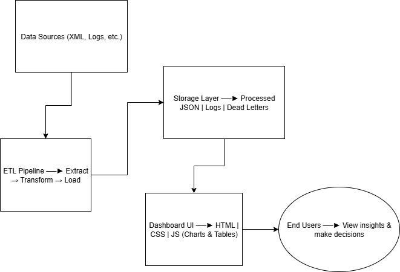

# Team: MoMo Masters

## Team Members
- Saddam Daahir Adam
- Uwineza Shamilla
- Kuzo Divine
- Nicole Mbera Umurerwa

---

## Project Description
This project is about processing **Mobile Money (MoMo) SMS data**.  
We plan to:
- Read MoMo transaction data from XML files.
- Clean and organize the data.
- Save it into a database.
- Build a dashboard to visualize transactions.

This README is for Week 1, where we focus on setting up the repository, folder structure, and planning.

---

## Project Structure (Skeleton)
momo-etl-dashboard/
├── etl/ # Python scripts for data processing (empty for now)
├── web/ # Frontend files (HTML, CSS, JS)
├── data/ # Raw and processed data
│ ├── raw/ # XML input
│ └── processed/ # Output files
├── scripts/ # Helper scripts
├── tests/ # Unit test placeholders
└── README.md

---

## Architecture Diagram

---

## Scrum Board
[https://github.com/orgs/ALUdevops7/projects/2/views/1]

  

---

## Notes
- Week 1 focus: repository setup, folder organization, team collaboration, and task planning.
